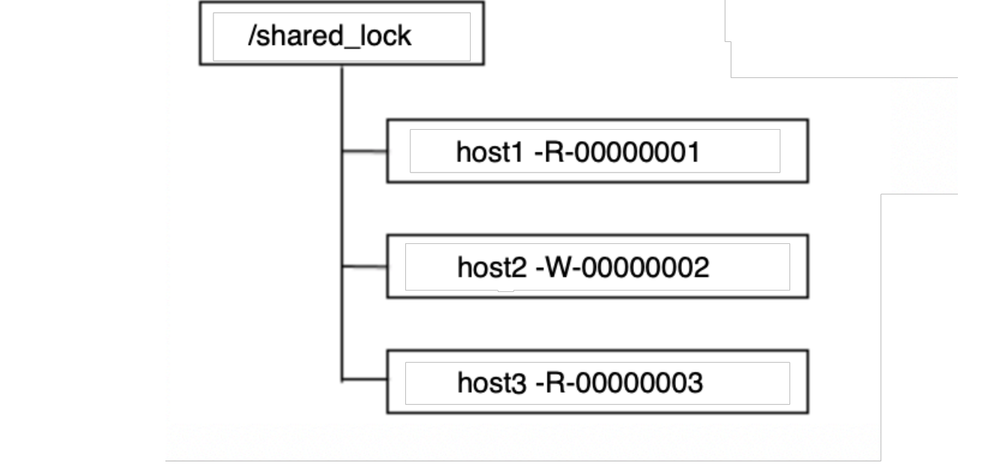
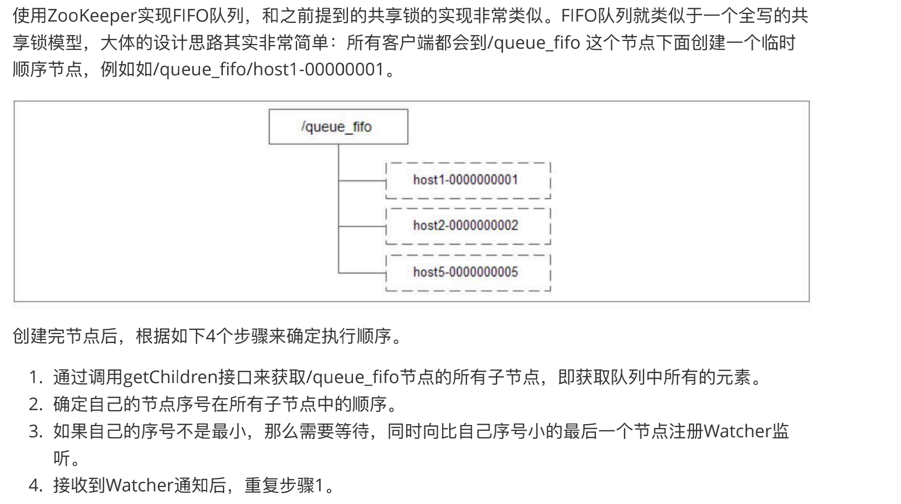
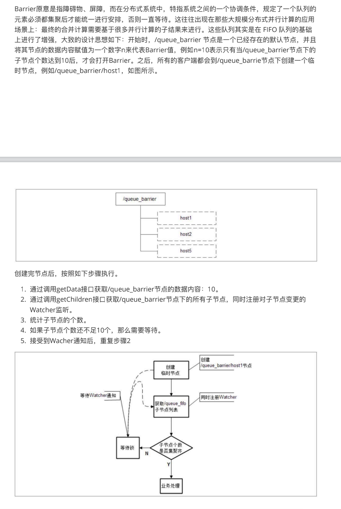
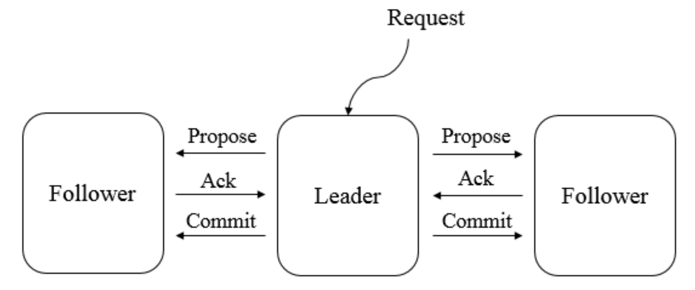
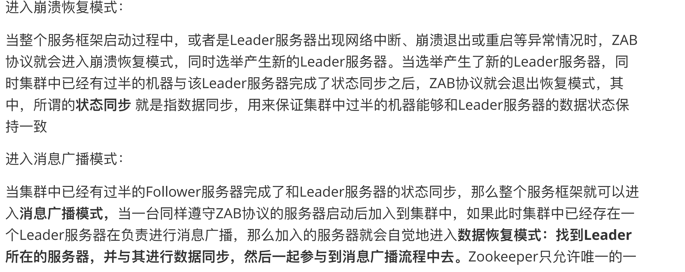
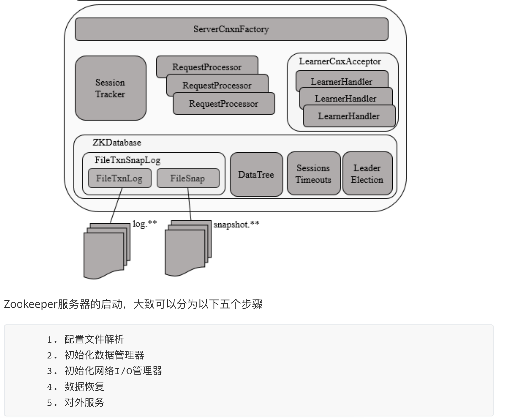
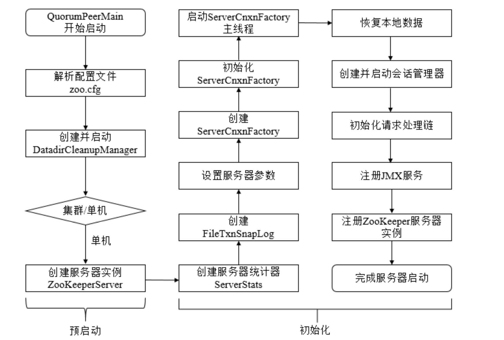
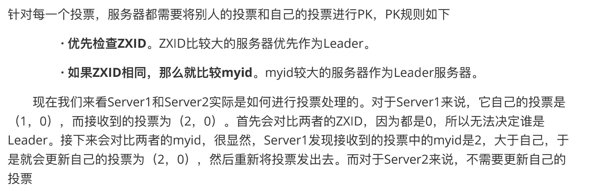

## **Zookeeper**


### 1.zookeeper 基本概念

​	开源的分布式协调服务。可以基于它实现如数据订阅/发布、负载均衡、命名服务、集群管理、分布式锁和分布式队列等功能

**基础概念**

- 集群角色

  在zk中存在三种角色分别为**leader、follower、observer。**

  zk集群中的所有机器通过leader选举选定一台机器作为leader。leader为客户端提供**读、写**服务。follower和observer都只能提供**读**服务。

  follower和observer 的区别在于 observer不参与leader选举过程。**不参与写操作的过半写成功策略**（不参与提议的投票）

- session

  session指客户端会话 一个客户端连接是指客户端和服务端之间的一个tcp长连接。zk对外的默认端口是2181.客户端与服务器连接后会通过**心跳检测**保证和zk服务器保持连接，并且通过这个链接，**客户端可以接受zk的watch事件**。
  

- 数据节点（Znode）

  在zk中节点分为两种，一种是构成集群的机器（机器节点），另一种是数据模型中的数据单元（数据节点）。zk将所有数据存储在**内存**中，数据模型是一棵树（znode tree）。由斜杠（/）进行分割。**每个node上都会保存自己的数据内容，并且还有一系列的属性信息**

  

- 版本

  zk的node上除了存储数据内容外，还有一系列的属性信息。对于每个node，zk都会为其维护一个stat的数据结构，stat记录了这个node 的三个数据版本

  分别为version（znode的版本）、cversion（当前znode子节点的版本）、aversion（当前znode的acl版本）

  

- watch（事件监听器）

  zk允许用户在指定的节点上注册一些watcher，**并且在一些特定的时间触发的时候。zk会将事件通知watch的客户端。**

  

- ACL（Access Control Lists）

  ​	CREATE:创建子节点权限

  ​	READ：获取节点数据和子节点列表权限

  ​	WRITE：更新节点数据权限

  ​	DELETE：删除子节点权限

  ​	ADMIN：设置节点acl权限

  **CREATE 和 DELETE都是针对子节点的权限控制**


### 2.环境搭建

zk有三种安装方式：**单机，集群，伪集群**

- **单机模式**

> 1. 下载解压zk软件包
>
> 2. 创建data文件夹用于保存快照和日志文件
>
> 3. 修改conf文件夹下面的**zoo.cfg**文件。将2中的文件路径配置上去
>
>    如：**dataDir**=/root/zookeeper-3.4.14/data
>
> 4. 进入bin文件夹 使用命令 **sh zkServer.sh start** 启动
>
> 5. 关闭服务命令**sh zkServer.sh stop **
>
> 6. 查看状态命令**sh zkServer.sh status **

- **集群、伪集群**

>1. 按照单机模式安装 但是需要注意修改配置文件防止端口冲突
>
>2. 配置集群
>
>   - 在**每个zk的data目录下**创建一个**myid**文件 内容分别为1，2，3。这个代表了这个服务器的id
>
>   - 在**每个zk的zoo.cfg**配置客户端访问端口（clientPort） 和集群服务器ip列表 如
>
>     >server.1=10.211.55.4:2881:3881
>     >
>     >server.2=10.211.55.4:2882:3882
>     >
>     >server.3=10.211.55.4:2883:3883
>
>3. 依次启动多个实例


### 3.zk 的基本使用（命令行）

- **连接zk服务**

  ```shell
  sh zkClient.sh (连接本地zk服务器 端口2181) 
  sh zkClient.sh -server ip:port (连接指定的服务器)
  ```

- **创建节点**

  ```shell
  create [-s][-e] path data acl
  ```

  -s 代表顺序节点， -e代表临时节点。如果不指定。则默认创建持久节点。path 代表创建的路径。data表示写入的数据。acl用于权限控制

  如：

  **create -s /zk-test 123** 创建顺序持续节点zk-test 并且内容是123

  **create -e /zk-temp 123** 创建临时节点zk-temp并且内容是123

- **读取节点**

  ```shell
  ls path
  ```

  path表示指定数据节点的路径  ls命令能查看指定节点下的第一级的所有子节点

  ​	

  ```shell
  get path
  ```

  get命令可以获取zk指定节点的数据内容和属性信息


- **更新节点**

  ```shell
  set path data [version]
  ```

  其中data代表更新的内容。version表示数据版本

- **删除节点**

  ```shell
  delete path [version]
  ```

  **若删除的节点存在子节点。则无法删除该节点。必须先删除子节点 再删除父节点**


### **4.API的使用**

#### 4.1 官方客户端

- **导入依赖**

  ```xml
  <dependency> 
    <groupId>org.apache.zookeeper</groupId> 
    <artifactId>zookeeper</artifactId> 
    <version>3.4.14</version>
  </dependency>
  ```

  

- **建立连接**

  ```java
  //connectString ip:port
  //sesssionTimeOut 会话超时时间 单位毫秒
  //Wather 监听器（当特定时间触发。zk通知客户端）
  ZooKeeper zooKeeper = new Zookeeper(connectString,sesssionTimeOut,Wather);
  ```

  zk客户端和服务器创建链接是一个**异步**的过程。也就是说在new Zookeeper(...)后会立刻返回，这个时候这个zk对象还没有真正链接上。**只有当zk服务器通过watch发送链接上的通知后，才算是真正的建立了回话**


- **创建节点**

  ```java
  //持久节点内容
  String node_PERSISTENT = zooKeeper.create("/lg_persistent", "持久节点内容".getBytes("utf-8"), ZooDefs.Ids.OPEN_ACL_UNSAFE, CreateMode.PERSISTENT);
  //持久顺序节点内容
  String node_PERSISTENT_SEQUENTIAL =zooKeeper.create("/lg_persistent_sequential", "持久顺序节点内容".getBytes("utf-8"),
  ZooDefs.Ids.OPEN_ACL_UNSAFE, CreateMode.PERSISTENT_SEQUENTIAL);
  //临时节点内容
  String node_EPERSISTENT = zooKeeper.create("/lg_ephemeral", "临时节点内容".getBytes(), ZooDefs.Ids.OPEN_ACL_UNSAFE, CreateMode.EPHEMERAL);
  ```

- **获取节点数据**

  ```java
  //获取节点的数据 第二个参数代表时候开启节点内容变动的watcher 第三个参数为数据版本，null代表获取最新数据
  byte[] data = zooKeeper.getData("/lg_persistent/lg-children", true,null);
  //获取节点的子节点 第二个参数代表时候开启子节点变动的watcher
  List<String> children = zooKeeper.getChildren("/lg_persistent", true);
  
  public void process(WatchedEvent watchedEvent){
    //子节点变更事件
    if(watchedEvent.getType() ==Event.EventType.NodeChildrenChanged){
    	……
  	}
    //连接创立事件
  	if(watchedEvent.getState() == Event.KeeperState.SyncConnected){
   	 	……
  	}
  }
  
  ```

- **修改节点数据**

  ```java
  //stat是节点状态信息对象 第三个参数-1 代表更新最新版本信息
  Stat stat = zooKeeper.setData("/lg_persistent", "客户端修改内容".getBytes(), -1);
  ```

- **删除节点**

  ```java
  //判断节点是否存在
  Stat exists = zooKeeper.exists("/lg_persistent/lg-children", false);
  System.out.println(exists == null ? "该节点不存在":"该节点存在");
  //删除节点
  zooKeeper.delete("/lg_persistent/lg-children",-1);
  ```

  

#### 4.2 开源客户端（**ZkClient**）

- **导入依赖**

  ```xml
  <dependency> 
    <groupId>com.101tec</groupId> 
    <artifactId>zkclient</artifactId> 
    <version>0.2</version>
  </dependency>
  ```

  

- **创建连接**

  ```java
  ZkClient zkClient = new ZkClient("127.0.0.1:2181");
  ```

  zkClient已经将zk原生的创建连接的**异步方式同步化**，所以new出来之后可以直接使用

- **创建节点**

  ```java
  //第二个参数为createParents 为true时代表如果父节点不存在自动递归创建
  zkClient.createPersistent("/lg-zkClient/lg-c1",true);
  ```

- **删除节点**

  ```java
  zkClient.deleteRecursive(path);
  ```

  zkClient可以直接删除带子节点的父节点。因为其先从底层删除所有子节点，在删除父节点

- **获取子节点**

  ```java
  List<String> children = zkClient.getChildren("/lg-zkClient");
  ```

- **注册watcher 事件**

  ```java
  zkClient.subscribeChildChanges(path, new IZkChildListener() {
  		public void handleChildChange(String parentPath, List<String>currentChilds) throws Exception {
  							System.out.println(parentPath + " 's child changed,currentChilds:" + currentChilds);
   	}
  });
  ```

  **zkClient可以对一个不存在的节点进行变更的监听。**

- 获取数据

  ```java
  //判断节点时候存在
  boolean exists = zkClient.exists(path);
  //获取节点内容
  Object o = zkClient.readData(path);
  //更新节点数据
  zkClient.writeData(path,"4567");
  //删除节点数据
  zkClient.delete(path);
  ```

#### 4.3开源客户端（**Curator**）

- **导入依赖**

  ```xml
  <dependency>
    <groupId>org.apache.curator</groupId> 
    <artifactId>curator-framework</artifactId> 
    <version>2.12.0</version>
  </dependency>
  ```

- **创建会话**

  ```java
  //retryPolicyn 重试接口，
  //默认提供ExponentialBackoffRetry（基于backoff的重连策略）
  //RetryNTimes（重试N次）
  //RetryForever（永远重试）
  //sessionTimeoutMs 会话超时时间 默认60s
  //connectionTimeoutMs 连接超时时间 默认15s
  public static CuratorFramework newClient(String connectString, RetryPolicy retryPolicy)
  public static CuratorFramework newClient(String connectString, int sessionTimeoutMs, int connectionTimeoutMs, RetryPolicy retryPolicy)
  //CuratorFramework的start方法启动会话
  client.start();
  ```

  实例代码 使用builder()

  ```java
  RetryPolicy retryPolicy = new ExponentialBackoffRetry(1000, 3);
  CuratorFramework client1 = CuratorFrameworkFactory.builder()
   .connectString("127.0.0.1:2181") //server地址
   .sessionTimeoutMs(5000) // 会话超时时间
   .connectionTimeoutMs(3000) // 连接超时时间
   .retryPolicy(retryPolicy) // 重试策略
   .namespace("base") // 独⽴命名空间/base
   .build(); //
  client1.start();
  ```

- 创建节点

  ```java
  //创建一个没有内容的节点
  client.create().forPath(path);
  //创建一个带内容的节点
  client.create().forPath(path,"我是内容".getBytes());
  //递归创建父节点 并且设置创建的节点类型为临时节点
  client.create().creatingParentsIfNeeded().withMode(CreateMode.EPHEMERAL).forPath(path);
  ```

  

- 删除节点

  ```java
  //删除节点
  client.delete().forPath(path);
  //删除节点并递归删除其子节点
  client.delete().deletingChildrenIfNeeded().forPath(path);
  //指定版本删除 如果此版本不存在提示 BadVersionException
  client.delete().withVersion(1).forPath(path);
  //强制删除某个节点 持续处理直到删除完成，在网络异常等情况下适用
  client.delete().guaranteed().forPath(path);
  ```

- 获取数据

  ```java
  // 普通查询
  client.getData().forPath(path);
  // 包含状态查询
  Stat stat = new Stat();
  client.getData().storingStatIn(stat).forPath(path);
  ```

- 更新数据

  ```java
  // 普通更新
  client.setData().forPath(path,"新内容".getBytes());
  // 指定版本更新 数据版本不一致时 throw BadVersionException
  client.setData().withVersion(1).forPath(path);
  ```

  

### 5.zk的应用场景

#### 5.1 数据发布**/**订阅（watcher）

​		zk适用推拉结合的方式，客户端告知zk自己感兴趣的节点，一旦这个节点发生变更（数据更新，新增，删除等）zk会给客户端发watcher事件通知，客户端获取道通知后需要主动从zk获取最新的数据。

#### 5.2 命名服务

​		生成记录id，使用zk的临时顺序节点特性，可以分别创建多个节点。比如/user 在这个节点下创建一个子节点，此时就能获取到一个自增的顺序id，使用这个id能保证每次生成的id都是唯一自增的。如果有多种记录，则创建多个父节点即可

#### 5.3 集群管理

​		集群管理包括**集群监控**（状态收集）和**集群管理**（操作与控制）两块。

zk的两大特性：

- 客户端可以使用watcher在zk上注册监听，在节点发生变化事件时及时得知。
- 客户端与zk有心跳检测机制，当客户端一段时间会话失效后，创建的临时节点会被zk自动清理

利用这两个特性可以监控集群中机器节点的存活情况。

**分布式日志系统**（略）

#### 5.4 Master选举

​	利用zk的强一致性（**能保证在分布式环境中能保证节点的唯一性**），如果有多个客户端去创建相同的节点，**zk能保证只有一个客户端能创建成功**。利用这个特性的。创建成功的这个机器就能被当作时master ，其他没有创建成功的机器对master创建的节点进行watcher 。当master挂了，创建的**临时节点**自动清除后，各个客户端能及时收到通知，并重新进行master选举

#### 5.5 分布式锁

- **排他锁**（Exclusive Locks 简称x锁、写锁、独占锁）

  基本流程为 

  机器1创建一个**临时节点**比如/exclusive_lock/lock。此时机器2也来创建这个节点，但是因为节点已经存在。创建失败（获取锁失败）。这时机器2对这个节点**创建watcher**，等待。当机器1完成任务后主动删除这个节点**或者**机器1运行过程中宕机了由zk主动删除临时节点。在节点删除后机器2收到节点变更的通知，此时机器2再去创建这个节点（获取锁）。其他机器执行类似操作

- **共享锁**（Shared Locks，S锁、读锁）



创建如上节点。次数对于host3 因为host2对数据时一个写操作，**所以host3需要等到host2执行完释放后才能进行**，而对于host1 因为前面没有了写操作。则可以获得执行。

共享锁的释放跟独占锁一样，客户端主动释放或者宕机被zk清除

**羊群效应**

如果host1客户端在移除了自己的临时节点后，zk会将节点变更通知到后面所有机器节点。然而除了host2外，这个通知对其他机器节点没有任何影响。当机器节点多时会对zk造成巨大的网络和性能的开销。

出现羊群效应的本质问题是没有找准机器节点真正需要添加wathcer的节点。

**改进** 

对于读请求，每个机器只对比自己序号小的**写请求**节点创建watcher。对于写请求，对比自己序号小的**最后一个节点**创建wathcer

上图中。即 host2对host1 创建watcher。host3对host2创建watcher


#### 5.6 分布式队列

分布式队列有两类，一种是FIFO先进先出的**队列模型**，一种是等待队列聚集后统一执行处理的**Barrier模型**


- FIFO

  


- Barrier 分布式屏障

  

### 6.zk深入进阶


#### 6.1 ZAB协议（Zookeeper Atomic Broadcast 原子广播协议）

> ​	所有事务请求必须由全局唯一的服务器（leader）来协调处理。其他的机器为follower服务器，leader服务器负责将客户端的事务转换成一个proposal（提议）。并将这个poposal分发给所有的follower。之后leader需要等待follower的反馈（投票）。一旦集群中半数以上的机器返回了正确的反馈，那么leader服务器再向所有的follower发送commit命令。要求所有服务器对上一次的proposal进行提交




ZAB协议包含两种基本模式：**崩溃恢复** 和 **消息广播**



**在崩溃恢复情况下：**

- ZAB协议需要确保那些已经在Leader服务器上提交的事务最终被所有服务器提交

- ZAB协议需要确保丢弃那些只在Leader服务器上被提出的事务


#### 6.2 zk启动





**预启动：**

>1. 统⼀由QuorumPeerMain作为启动类。⽆论单机或集群，在zkServer.cmd和zkServer.sh 中都配置了QuorumPeerMain作为启动⼊⼝类。
>
>2. 解析配置⽂件zoo.cfg。zoo.cfg配置运⾏时的基本参数，如tickTime、dataDir、clientPort等参数。
>
>3. 创建并启动历ݥ⽂件清理器DatadirCleanupManager。对事务⽇志和快照数据⽂件进⾏定时清理。
>
>4. 判断当前是集群模式还是单机模式启动。若是单机模式，则委托给ZooKeeperServerMain进⾏启动。
>
>5. 再次进⾏配置⽂件zoo.cfg的解析。
>
>6. 创建服务器实例ZooKeeperServer。Zookeeper服务器⾸先会进⾏服务器实例的创建，然后对该服务器实例进⾏初始化，包括连接器、内存数据库、请求处理器等组件的初始化。

**初始化：**

>1. 创建服务器统计器ServerStats。ServerStats是Zookeeper服务器运⾏时的统计器。
>
>2. 创建Zookeeper数据管理器FileTxnSnapLog。FileTxnSnapLog是Zookeeper上层服务器和底层数据存储之间的对接层，提供了⼀系列操作数据⽂件的接⼝，如事务⽇志⽂件和快照数据⽂件。Zookeeper根据zoo.cfg⽂件中解析出的快照数据⽬录dataDir和事务⽇志⽬录dataLogDir来创建FileTxnSnapLog。
>
>3. 设置服务器tickTime和会话超时时间限制。
>
>4. 创建ServerCnxnFactory。通过配置系统属性zookeper.serverCnxnFactory来指定使⽤Zookeeper⾃⼰实现的NIO还是使⽤Netty框架作为Zookeeper服务端⽹络连接⼯⼚。
>
>5. 初始化ServerCnxnFactory。Zookeeper会初始化Thread作为ServerCnxnFactory的主线程，然后再初始化NIO服务器。
>
>6. 启动ServerCnxnFactory主线程。进⼊Thread的run⽅法，此时服务端还不能处理客户端请求。
>
>7. 恢复本地数据。启动时，需要从本地快照数据⽂件和事务⽇志⽂件进⾏数据恢复。
>
>8. 创建并启动会话管理器。Zookeeper会创建会话管理器SessionTracker进⾏会话管理。
>
>9. 初始化Zookeeper的请求处理链。Zookeeper请求处理⽅式为责任链模式的实现。会有多个请求处理器依次处理⼀个客户端请求，在服务器启动时，会将这些请求处理器串联成⼀个请求处理链。
>
>10. 注册JMX服务。Zookeeper会将服务器运⾏时的⼀些信息以JMX的⽅式暴ᶂ给外部。
>
>11. 注册Zookeeper服务器实例。将Zookeeper服务器实例注册给ServerCnxnFactory，之后Zookeeper就可以对外提供服务。

以上是**单机模式**下启动zk。集群模式下的启动流程多了 **Leader选举，Leader和Follower**交互过程

#### 6.3 leader选举规则




